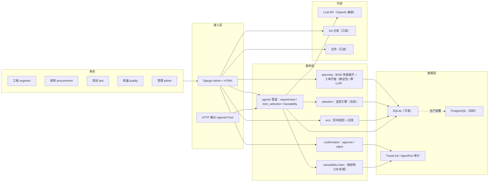
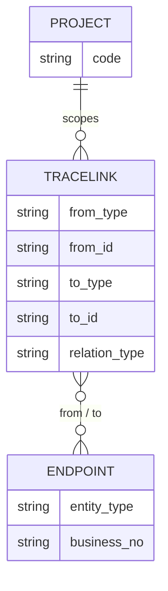
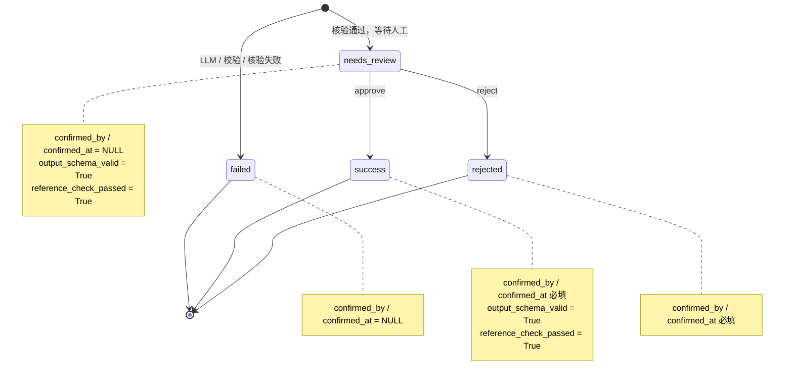

# ThreadLink 架构图（D13-R2）

> 单文件承载四张 Mermaid 图 + 读图说明。系统边界与决策以 `docs/adr/`（0001–0017）与
> `docs/interface_contract.md` 为权威；完整数据模型见 `docs/er_diagram.md`。
>
> **语法自检**：节点文本一律用 `"..."` 包裹，内部只用全角括号、不含双引号 / 分号；
> `erDiagram` 关系名规范、注释行以 `%%` 开头且不与语法同行。**GitHub 端渲染确认列为 R3 前置动作。**

---

## 1. 系统总览



**读图**：角色（五职能）只经 **Admin + HTMX** 或受限 HTTP 端点进入，权限仅落在 Admin 写路径（ADR-0016）。
服务层分三类：**确定性计算**（planning 展开/齐套、selection 引擎，零 LLM）、**写路径**（ecn 应用、confirmation）、
**LLM 管道**（agents）。跨域追溯统一落 `TraceLink`，LLM 调用统一落 `AgentRun`（审计）。数据层开发用 SQLite、
目标为 PostgreSQL；外部 LLM API 可换端点（ADR-0008），Git 与文件严格只读。

---

## 2. 追溯视角（TraceLink 中心）



**读图**：`TraceLink` 为**多态边**（`from_*` / `to_*` 存**业务编号**而非主键），任何跨域关系统一走它——
这是全系统唯一追溯入口。两端 `ENTITY` 抽象为 **13 类白名单**（`EntityType`）：强结构关系（层级/包含/归属）
仍用 FK，不进 TraceLink。`User` / `Project` 仅经 FK、`AgentRun` / `TraceLink` 为审计记录、明细表无业务编号，
均不作端点。**完整 ER（FK 强关系）见 `docs/er_diagram.md`**。

---

## 3. Agent 管道

```mermaid
flowchart TD
    input["输入：Document / 序列号 / 项目 criteria"] --> load["prompt 装载：system + user_template + schema"]
    load --> call["call_json：provider 结构化输出"]
    call --> pyd["Pydantic 校验：冻结 schema"]
    pyd --> verify["引用核验：verify_references"]
    verify -->|通过| nr["AgentRun = needs_review"]
    verify -->|失败| failed["AgentRun = failed + invalid_references"]
    nr --> decide["人工处置：AgentRunAdmin"]
    decide -->|approve| write["写实体 + TraceLink / 或纯审计确认"]
    decide -->|reject| rejected["AgentRun = rejected + human-rejected 落档"]
    failed --> archive["失败样例落档（防幻觉，保持可审计）"]

    subgraph short["未命中短路分支（GT-TRACE-003）"]
        miss["序列号未命中：found=false"]
        miss --> nollm["零 LLM 调用 / 不建 AgentRun / 不记 failed"]
    end
```

**读图**：三 Agent 共用一条管道——**输入 → prompt 装载 → 结构化调用 → Pydantic 校验 → 引用核验 → 落 `AgentRun`**。
核验通过进 `needs_review` 等待人工；失败当场转 `failed` 并落档。`output_json` 一律存**合并后的冻结输出模型**
（D6 教训），可再反序列化。**未命中短路**为独立分支：只返回 `found=false` 链负载，**零 LLM、不建 `AgentRun`、不记 `failed`**。
人工处置：`requirement`/`bom_selection` **approve 写实体 + TraceLink**，`traceability` 为**纯审计确认**（零实体写入，ADR-0013）。

---

## 4. AgentRun 状态机



**读图**：`AgentRun` 固定**四值**。机器侧产生 `failed` / `needs_review`，二者的 `confirmed_by` / `confirmed_at`
**必须为 NULL**；人工处置产生 `success` / `rejected`，二者**必填**确认人/时间，且为**终态**（不可再处置）。
`success` 额外要求 `output_schema_valid=True` 且 `reference_check_passed=True`。该四值与绑定规则是审计不变量
（`tests/test_audit_r3.py`），approve/reject 全程事务、幂等（ADR-0010）。