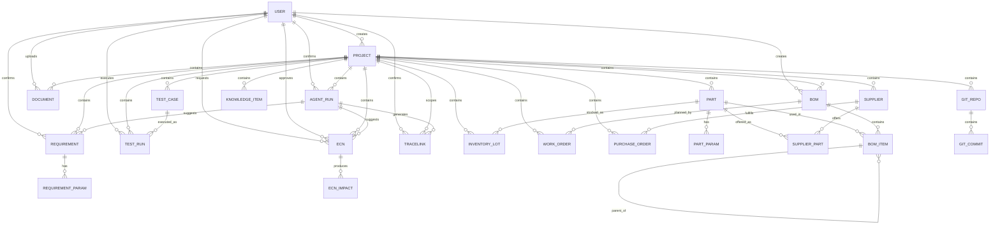

# ThreadLink ER 图与数据模型边界

> 数据建模基线。核心目标是：**强结构关系（层级 / 包含 / 归属）用 FK，跨域追溯关系用 TraceLink 多态表**。字段类型与必填约束见 `docs/data_dictionary.md`。

---

## 1. Mermaid erDiagram

> 说明：下图只画 **FK 强关系**。`TRACELINK` 为多态表，其 `from_*` / `to_*` 指向任意实体，无法用 FK 连线表达，故单独在图后列出。

---

## 2. TraceLink 覆盖的跨域追溯关系

`TraceLink` 是**多态追溯表**，`(from_type, from_id)` → `(to_type, to_id)`。以下为设计与演示必需的关系示例（非穷举，实际由 `relation_type` 扩展）：

| from_type | to_type | relation_type（建议） | 业务含义 |
| --- | --- | --- | --- |
| Requirement | Document | derived_from | 需求源自某邮件 / PRD / SOR |
| Requirement | Part | satisfied_by | 物料满足需求 |
| Requirement | Bom | implemented_by | BOM 实现需求 |
| Requirement | TestCase | verified_by | 需求由某测试验证 |
| BomItem | Document | documented_by | BOM 节点关联图纸 / 规格书 |
| Part | PurchaseOrder | ordered_by | 物料被某采购单采购 |
| Part | Document | documented_by | 物料关联数据手册 |
| InventoryLot | PurchaseOrder | sourced_from | 批次来自某采购单 |
| InventoryLot | TestRun | tested_by | 批次 / 样机被测试 |
| TestRun | ECN | affected_by | 测试受变更影响 |
| ECN | BomItem | affects | ECN 影响 BOM 节点 |
| ECN | InventoryLot | affects | ECN 影响库存批次 |
| ECN | PurchaseOrder | affects | ECN 影响在途 PO |
| ECN | TestCase | affects | ECN 影响测试用例 |
| GitCommit | Requirement | evidences | 代码提交作为需求证据 |
| GitCommit | BomItem | evidences | 代码提交作为 BOM 节点证据 |
| WorkOrder | InventoryLot | allocates | 工单分配批次 |
| Part | Part | replaces | 替代料关系 |

---

## 3. relation_type 枚举建议

`relation_type` 用 `varchar` 存储（不建数据库 enum，便于演进），取值受应用层白名单约束。建议枚举：

| 枚举值 | 语义 | 典型方向 |
| --- | --- | --- |
| `derived_from` | 由某来源派生 | Requirement → Document |
| `satisfied_by` | 被某对象满足 | Requirement → Part |
| `implemented_by` | 由某对象实现 | Requirement → Bom |
| `verified_by` | 由某对象验证 | Requirement → TestCase |
| `documented_by` | 由文档说明 | BomItem / Part → Document |
| `ordered_by` | 被采购单采购 | Part → PurchaseOrder |
| `sourced_from` | 来源于 | InventoryLot → PurchaseOrder |
| `tested_by` | 被测试 | InventoryLot → TestRun |
| `affected_by` | 受某变更影响 | TestRun → ECN |
| `affects` | 影响某对象 | ECN → BomItem / InventoryLot / PurchaseOrder / TestCase |
| `evidences` | 作为证据 | GitCommit → Requirement / BomItem |
| `allocates` | 分配给 | WorkOrder → InventoryLot |
| `replaces` | 替代 | Part → Part（单向：替代 → 被替代） |
| `supersedes` | 版本取代 | Bom → Bom（新版本 → 旧版本） |
| `references` | 一般引用（兜底，需附 metadata 说明） | 任意 |

约束建议：
- `replaces` / `supersedes` 为**有向**关系，不做双向对称记录。
- 每条 `TraceLink` 唯一性由 `(project_id, from_type, from_id, to_type, to_id, relation_type)` 保证。
- `relation_type` 与 `(from_type, to_type)` 的搭配由应用层校验白名单，避免出现无语义组合。

---

## 4. 索引建议

### 4.1 TraceLink（重点）

| 索引 | 类型 | 用途 |
| --- | --- | --- |
| `(project_id, from_type, from_id)` | 普通 | 正向展开追溯链 |
| `(project_id, to_type, to_id)` | 普通 | 反向反查（如序列号 → 需求） |
| `(project_id, relation_type)` | 普通 | 按关系类型过滤 |
| `(project_id, from_type, from_id, to_type, to_id, relation_type)` | 唯一 | 去重 |
| `(agent_run_id)` | 普通 | 审计回溯 |
| `(confirmed_by_id)` | 普通 | 确认人审计 |

### 4.2 业务实体

| 表 | 索引 | 类型 | 说明 |
| --- | --- | --- | --- |
| Part | `(project_id, part_number)` | 唯一 | 料号项目内唯一 |
| Part | `(project_id, lifecycle_status)` | 普通 | 停产 / EOL 过滤 |
| Requirement | `(project_id, code)` | 唯一 | 需求编号 |
| Requirement | `(project_id, status)` | 普通 | 按确认状态过滤 |
| Bom | `(project_id, version)` | 唯一 | 版本唯一 |
| BomItem | `(bom_id)` / `(parent_item_id)` / `(part_id)` | 普通 | BOM 展开与层级遍历 |
| SupplierPart | `(supplier_id, part_id)` | 唯一 | 供料关系去重 |
| InventoryLot | `(project_id, serial_number)` | 唯一 | 序列号 / 批次唯一 |
| InventoryLot | `(part_id, status)` | 普通 | 按物料查可用批次 |
| PurchaseOrder | `(project_id, po_number)` | 唯一 | 采购单号 |
| PurchaseOrder | `(supplier_id, status)` | 普通 | 按供应商 / 在途过滤 |
| TestCase | `(project_id, code)` | 唯一 | 用例编号 |
| TestRun | `(test_case_id)` / `(result)` | 普通 | 结果统计 |
| ECN | `(project_id, ecn_number)` | 唯一 | 变更单号 |
| ECN | `(project_id, status)` | 普通 | 状态过滤 |
| ECNImpact | `(ecn_id)` / `(affected_type, affected_id)` | 普通 | 影响面查询 |
| Document | `(project_id, doc_type)` / `(checksum)` | 普通 | 分类 / 去重 |
| GitRepo | `(project_id, name)` | 唯一 | 仓库名唯一 |
| GitCommit | `(repo_id, sha)` | 唯一 | 提交去重 |
| GitCommit | `(committed_at)` | 普通 | 时间排序 |
| AgentRun | `(project_id, agent_name, status)` | 普通 | 审计检索 |

---

## 5. TraceLink 与 FK 的边界说明

### 5.1 判定口径（三条互斥规则）

1. **生命周期依赖 → FK**：删除父对象时子对象应一并消失的，用 FK + `ON DELETE CASCADE`。例：`Bom → BomItem`、`Requirement → RequirementParam`、`Part → PartParam`、`TestCase → TestRun`、`ECN → ECNImpact`、`GitRepo → GitCommit`。
2. **结构性归属 / 计算强依赖 → FK**：关系稳定、参与 BOM 展开与齐套计算的高频遍历，用 FK。例：`*.project_id`、`BomItem.part_id`、`BomItem.parent_item_id`、`WorkOrder.bom_id`、`InventoryLot.part_id`、`PurchaseOrder.supplier_id`。
3. **跨域、可审计、多对多、语义丰富 → TraceLink**：需要记录来源 / 置信度 / 确认人的追溯关系。例：`Requirement → Part`、`Part → PurchaseOrder`、`InventoryLot → TestRun`、`ECN → BomItem`、`GitCommit → Requirement`。

一句话：**问"删了父对象子对象要不要跟着没"——要没就是 FK；问"这条关系要不要留下是谁、凭什么、谁确认的痕迹"——要留就是 TraceLink。**

### 5.2 必须用 FK 的场景

- **层级 / 包含**：`Bom → BomItem`、`BomItem → BomItem`（自引用父子）、`Requirement → RequirementParam`、`Part → PartParam`、`TestCase → TestRun`、`GitRepo → GitCommit`、`ECN → ECNImpact`。
- **BOM 展开与齐套**：`BomItem.part_id` 必须是 FK——若塞进 TraceLink，BOM 多级展开与齐套计算需反复跨多态表 join，性能与可维护性都会崩坏。
- **结构归属**：各类 `project_id`、`PurchaseOrder.supplier_id`、`WorkOrder.bom_id`、`InventoryLot.part_id`、`SupplierPart.part_id/supplier_id`。
- **审计外键**：`agent_run_id`、`confirmed_by_id`、`created_by_id` 等指向 `AgentRun` / `User` 的引用。

### 5.3 必须用 TraceLink 的场景

- **跨域追溯**：需求 ↔ 物料 / BOM / 测试、物料 ↔ 采购、批次 ↔ 测试 / 采购、ECN ↔ 各受影响对象。
- **文件与 Git 证据**：`Document` / `GitCommit` 与任意业务对象的证据关联。
- **智能体产出**：需携带 `confidence`、`source`、`agent_run_id`、`confirmed_by` 的关系。
- **多对多且带语义**：一个需求由多个物料满足、一个批次被多次测试、一个 ECN 影响多个节点。

### 5.4 反模式（明确禁止）

- ❌ **把所有关系都塞进 TraceLink**：会导致 BOM 展开困难、无法用数据库约束保证层级完整性。层级必须 FK。
- ❌ **全部用 FK**：跨域追溯无法统一表达、无法承载来源 / 置信度 / 确认人，审计链断裂。
- ❌ **隐式旁路**：为跨域关系私加 FK（如直接给 `Requirement` 加 `part_id`）绕过 TraceLink，破坏"追溯链唯一通道"原则。
- ❌ **ECNImpact 与 TraceLink 职责混淆**：`ECNImpact` 是影响分析的**计算结果明细**（可重算、随 ECN 级联删除，用 `ecn_id` FK + 多态 `affected_type/affected_id`）；影响经人工确认后，另写一条 `ECN → 目标` 的 `TraceLink` 作为**审计性关联**。两者并存，职责不同：前者面向计算，后者面向追溯与审计。

### 5.5 冗余与一致性

- 允许在 TraceLink 的 `metadata` 中冗余少量快照信息（如料号、批次号），但**权威来源仍是目标实体**。
- 涉及计算的强关系（BOM 层级）只存 FK，不重复写入 TraceLink；若确需在追溯 UI 中展示 BOM 层级，由 FK 实时查询生成，不落库冗余。